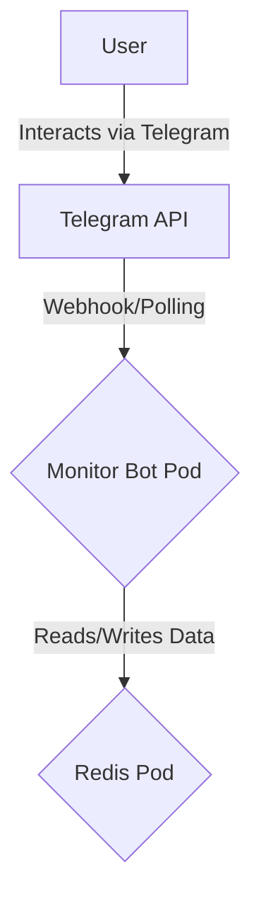

# Website Monitor Telegram Bot

This project provides a simple yet powerful Telegram bot that monitors a list of websites for changes. When a change is detected on a monitored URL, the bot sends a notification to the user via Telegram.

The application is containerized with Docker, uses Redis for persistent storage, and is deployed and managed using a Helm chart on Kubernetes.

\!

## Architecture

The application consists of two main components deployed within a Kubernetes cluster:

1.  **Monitor Bot**: A Python application that communicates with the Telegram API, checks websites periodically, and uses Redis to store its state.
2.  **Redis**: A lightweight in-memory database used to persist the list of monitored URLs and their content hashes for each user.

The Helm chart manages the deployment of both components and their configuration.



## Prerequisites

Before you begin, ensure you have the following tools installed and configured.

### Common Prerequisites

  * **Git**: To clone the repository. [Install Git](https://git-scm.com/book/en/v2/Getting-Started-Installing-Git)
  * **Docker**: To build and push the application container image. [Install Docker](https://docs.docker.com/get-docker/)
  * **Helm**: The package manager for Kubernetes. [Install Helm](https://helm.sh/docs/intro/install/)
  * **kubectl**: The command-line tool for interacting with a Kubernetes cluster. [Install kubectl](https://kubernetes.io/docs/tasks/tools/install-kubectl/)
  * **Telegram Bot Token**: You'll need a token from BotFather. [Talk to BotFather](https://t.me/botfather)
  * **Docker Hub Account**: To host your container image. [Create Docker Hub Account](https://hub.docker.com/)

### Local Deployment Prerequisites

  * **Minikube** or **Docker Desktop with Kubernetes enabled**. This guide will use Minikube as the example. [Install Minikube](https://minikube.sigs.k8s.io/docs/start/)

### Azure (AKS) Deployment Prerequisites

  * **Azure Account**: An active Azure subscription. [Create a free Azure account](https://azure.microsoft.com/free/)
  * **Azure CLI**: The command-line interface for managing Azure resources. [Install Azure CLI](https://docs.microsoft.com/en-us/cli/azure/install-azure-cli)

-----

## Deployment Steps

The deployment process involves building the Docker image, pushing it to a registry, and then using Helm to deploy it to your chosen Kubernetes environment.

### Step 1: Clone the Repository

Clone this project to your local machine.

```bash
git clone git@github.com:anirbanbhat/monitor-bot.git
cd monitor-bot
```

### Step 2: Build and Push the Docker Image

The application needs to be packaged as a Docker image and pushed to a container registry that your Kubernetes cluster can access. We'll use Docker Hub.

1.  **Log in to Docker Hub:**

    ```bash
    docker login
    ```

    Enter your Docker Hub username and password (or an access token).

2.  **Build the image:**
    Replace `YOUR_DOCKER_USERNAME` with your actual Docker Hub username.

    ```bash
    docker build -t YOUR_DOCKER_USERNAME/monitor-bot:1.0.0 .
    ```

3.  **Push the image:**

    ```bash
    docker push YOUR_DOCKER_USERNAME/monitor-bot:1.0.0
    ```

-----

### Step 3: Deploying the Application

Now you can deploy the application to either a local cluster or a managed cluster in Azure.

#### A) Local Deployment (Minikube)

1.  **Start your local Kubernetes cluster:**

    ```bash
    minikube start
    ```

2.  **Add the Bitnami Helm repository** (which hosts the Redis chart):

    ```bash
    helm repo add bitnami https://charts.bitnami.com/bitnami
    helm repo update
    ```

3.  **Build Helm Dependencies:**
    Navigate to the Helm chart directory and download the Redis dependency.

    ```bash
    cd helm/monitor-bot
    helm dependency build
    cd ../..
    ```

4.  **Install the Helm Chart:**
    Run this command from the `helm/` directory. Replace the placeholder values for `telegramToken` and the image `repository`.

    ```bash
    helm install monitor-bot ./monitor-bot \
      --set telegramToken="YOUR_TELEGRAM_TOKEN" \
      --set app.image.repository="YOUR_DOCKER_USERNAME/monitor-bot" \
      --set app.image.tag="1.0.0"
    ```

#### B) Azure Deployment (AKS)

1.  **Log in to Azure:**

    ```bash
    az login
    ```

2.  **Create a Resource Group:**
    Choose a name and location for your resources.

    ```bash
    az group create --name MonitorBotRG --location "East US"
    ```

3.  **Create the AKS Cluster:**
    This command creates a small, cost-effective 1-node cluster.

    ```bash
    az aks create \
      --resource-group MonitorBotRG \
      --name MonitorBotCluster \
      --node-count 1 \
      --node-vm-size Standard_B2s \
      --enable-managed-identity \
      --generate-ssh-keys
    ```

4.  **Configure `kubectl` to connect to your AKS cluster:**

    ```bash
    az aks get-credentials --resource-group MonitorBotRG --name MonitorBotCluster
    ```

5.  **Deploy the Helm chart:**
    The steps are now **identical** to the local deployment.

    ```bash
    # Add Bitnami repo
    helm repo add bitnami https://charts.bitnami.com/bitnami
    helm repo update

    # Build dependencies
    cd helm/monitor-bot
    helm dependency build
    cd ../..

    # Install the chart
    helm install monitor-bot ./monitor-bot \
      --set telegramToken="YOUR_TELEGRAM_TOKEN" \
      --set app.image.repository="YOUR_DOCKER_USERNAME/monitor-bot" \
      --set app.image.tag="1.0.0"
    ```

-----

### Step 4: Verify and Manage the Deployment

Once you've run the `helm install` command, you can manage the application with `kubectl`.

  * **Check the status of your pods:**
    It may take a minute or two for the containers to download and start.

    ```bash
    kubectl get pods -w
    ```

    Wait until both the `monitor-bot-deployment` and `monitor-bot-redis-master` pods show `Running`.

  * **Check the logs of the bot:**
    Find your pod's full name with `kubectl get pods` and then view its logs.

    ```bash
    kubectl logs -f <your-monitor-bot-pod-name>
    ```

    You should see `Successfully connected to Redis` and `Bot started polling...`.

  * **Interact with the Bot:**
    Open Telegram and start a conversation with your bot. Use the `/start`, `/monitor`, `/list`, and `/stop` commands.

  * **Uninstall the application:**
    To remove the bot and the Redis database from your cluster, use `helm uninstall`.

    ```bash
    helm uninstall monitor-bot
    ```

-----

## Troubleshooting

  * **Pod status is `ImagePullBackOff`**:

      * **Cause**: Kubernetes cannot download your Docker image.
      * **Solution**: Double-check that you replaced `YOUR_DOCKER_USERNAME` correctly in your `helm install` command. Ensure the image `your-username/monitor-bot:1.0.0` exists and is public on Docker Hub. Use `kubectl describe pod <pod-name>` to see the detailed error.

  * **Pod status is `CrashLoopBackOff`**:

      * **Cause**: The application is starting but then exiting due to an error.
      * **Solution**: Check the logs with `kubectl logs <pod-name>`. This is often caused by an invalid `telegramToken` or an issue connecting to Redis.

  * **Helm error: `...found in Chart.yaml, but missing in charts/ directory: redis`**:

      * **Cause**: You did not download the chart dependencies.
      * **Solution**: Navigate to `helm/monitor-bot` and run `helm dependency build`.